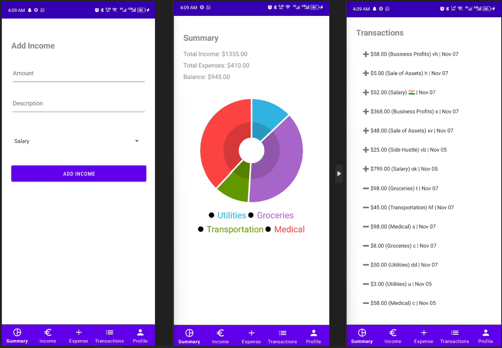

Here’s the updated README with a **Screenshots** section added:

---

# 📱 Penny: Personal Finance Manager

Penny is a Java-based Android app designed to help users manage their finances with ease. It leverages **Firebase** for secure user authentication and backend functionality, enabling users to track their income and expenses effortlessly. With a simple and user-friendly interface, Penny empowers users to stay organized and take control of their financial health.

---

## 🚀 Features
- 🔐 **Secure Authentication** with Firebase
- 💸 Track **Income** and **Expenses**
- 📊 Visual summaries of your finances
- 🧾 CRUD operations for financial entries

---

## 🖼️ Screenshots
Here are some screenshots showcasing the features of Penny:




---

## 📥 Getting Started

### Prerequisites
1. **Android Studio** installed on your computer
2. A **Firebase Project** set up with:
   - Firebase Authentication
   - Firestore Database

---

### 🛠️ Setup and Run

1. **Clone the Repository**
   ```bash
   git clone https://github.com/yourusername/penny.git
   cd penny
   ```

2. **Replace the `google-services-example.json` File**  
   Replace the placeholder `google-services-example.json` in the `app` directory with the correct `google-services.json` downloaded from Firebase.

3. **Open in Android Studio**  
   Open the project and sync Gradle when prompted.

4. **Run the App**  
   Connect a device or emulator and run the project.

---

## 👩‍💻 Contributing

Contributions are welcome! Feel free to fork this repository and submit a pull request.

---

## 📄 License

This project is licensed under the [MIT License](LICENSE).

---

## 🎉 Let's Stay Connected!

If you found Penny helpful, give this repository a ⭐ and share your feedback!

---